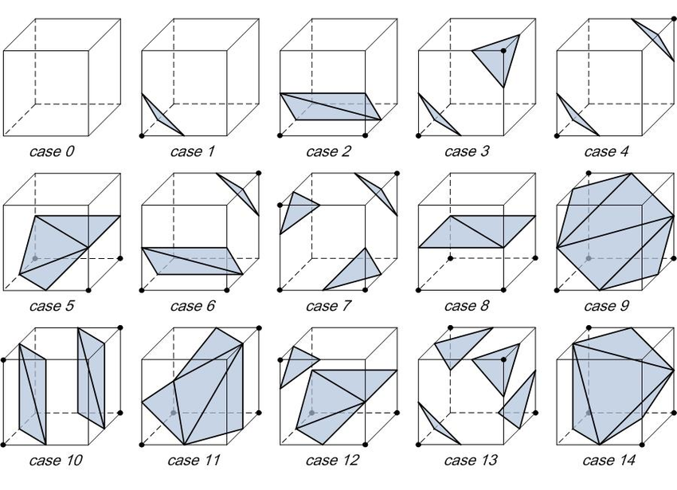

<p align="center">
   <i>
      A 3D terrain generator and editor
   </i>
</p>

## Table of Contents

- [Features](#features)
- [Installation](#installation)
- [Technology](#technology)
- [Algorithm](#algorithm)
- [Optimizations](#optimizations)
- [Acknowledgements](#acknowledgements)

## Features

### Noise editor


<p align="center">
  <i>
    Adjustable noise for varied terrain options
  </i>
</p>

Uses three layers of noise values at different frequencies and strengths in order to create a more detailed landscape

```js
noiseValue =
  1 * noise(x / frequency1, y / frequency1, z / frequency1) +
  0.5 * noise(x / frequency2, y / frequency2, z / frequency2) +
  0.25 * noise(x / frequency3, y / frequency3, z / frequency3);
```

**Options**

- Sliders to adjust noise frequencies
- Button to generate random seed
- Toggle interpolation and wireframe view

---

### First person mode


<p align="center">
  <i>
    Explore the terrain in first person
  </i>
</p>

**Controls**

- `W`,`A`,`S`,`D` or `Arrow Keys` to move
- `Space` to jump
- `Mouse` to look around

---

### Terrain editor


<p align="center">
  <i>
    Deformable terrain in real time
  </i>
</p>

**Controls**

- `Left Click` to add terrain
- `Right Click` to remove terrain

## Installation

Install the dependencies and run the app

```sh
cd marching-cubes-v2
npm install
npm run dev
```

Run tailwind to edit the CSS and styling

```sh
npm run tailwind
```

## Technology

- [Three.js] - Library for creating 3D graphics in a web browser
- [Typescript] - Superset of Javascript with strong static typing
- [TailwindCSS] - CSS framework for rapid styling
- [Vite] - Frontend build tool for quicker development

## Algorithm

Marching cubes is an algorithm used for generating 3D terrain. It works by sampling the corner points of a cube using a function that takes in a point and returns a single value.

If the value is below a certain "surface-level" threshold, it is considered empty space. However, if the value is above the surface-level value then it is considered to be inside the surface, or underground.

After doing this for each corner of the cube, we get a list of above-ground and underground points, and the goal is to construct a surface to surround the underground points.

Repeat this for each cube in a chunk and the result is a terrain-like shape.



<p align="center">
  <i>
    Bolded corners are underground and a surface is created to enclose the corner
  </i>
</p>

## Optimizations

From taking seconds just to render a few chunks, to an infinite chunk generator with deformable terrain, here are some of the optimizations that made it all possible.

| Optimization   | Result                                                                                                                                                                                                                                                                                                                                                                                                                                              |
| -------------- | --------------------------------------------------------------------------------------------------------------------------------------------------------------------------------------------------------------------------------------------------------------------------------------------------------------------------------------------------------------------------------------------------------------------------------------------------- |
| BufferGeometry | Buffer geometries are a feature in Three.js that store geometry data in buffers representing parallel arrays. This reduces the amount of memory and time used to store and transform the data.                                                                                                                                                                                                                                                      |
| Noise Caching  | On the noise editor page, sliding the frequency sliders requires recomputing the noise map multiple times per second. To reduce the number of computations required, noise values are cached so that only the layer that changes will get recomputed and added on to the cached values.                                                                                                                                                             |
| Simplex Noise  | Simplex noise is an improved version of Perlin noise. It requires less calculations, scales better to higher dimensions, and reduces directional artifacts. It has a complexity of $O(n^2)$ as opposed to Perlin noise's $O(n2^n)$ where $n$ is the number of dimensions.                                                                                                                                                                           |
| Web Workers    | While Javascript is a single-threaded language, web workers make it possible to create multithreaded applications by running scripts in background threads. They are used in the first person mode to calculate the noise maps and meshes of new chunks in parallel, allowing the main thread to focus on rendering and handling input. This significantly improves the framerate and prevents the window from freezing up when loading new chunks. |

## Acknowledgements

Inspired by Sebastian Lague's [Coding Adventure: Marching Cubes](https://www.youtube.com/watch?v=M3iI2l0ltbE&ab_channel=SebastianLague)
<br/>
Improved version of [marching-cubes](https://github.com/ivanwang123/marching-cubes) ([site](https://marching-cubes.vercel.app))

[//]: #
[three.js]: https://threejs.org
[typescript]: https://www.typescriptlang.org
[tailwindcss]: https://tailwindcss.com
[vite]: https://vitejs.dev
